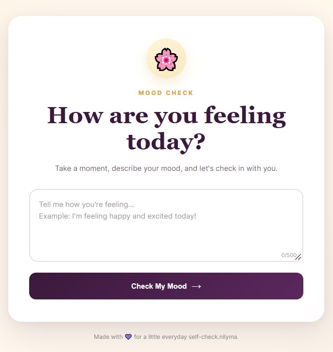

# 🌸 Mood Check

> A simple, interactive, browser-based mood checking tool that lets users describe how they are feeling and instantly receive a mood result.

Mood Check is a lightweight frontend project designed to make emotional self-checking simple and interactive. Users can describe their current feelings in natural language, and the application analyzes common keywords and phrases to identify a possible mood.

The project runs entirely in the browser and does not require a backend, database, or external API.

---

## 🌐 Live Demo

Try Mood Check directly in your browser:

**[▶ Check Your Mood](YOUR_LIVE_URL)**

> Replace `YOUR_LIVE_URL` with your deployed GitHub Pages or Vercel URL.

---

## 🖼️ Preview



The interface allows users to describe how they are feeling and instantly receive a mood result with:

- Mood emoji
- Mood category
- Mood description
- Visual mood meter
- A small personalized suggestion

---

## ✨ Features

- 📝 Describe your current mood in your own words
- 😊 Detects different mood categories
- 🧠 Rule-based mood detection using JavaScript
- 💬 Supports common English mood expressions
- 🇧🇩 Supports common Bengali mood expressions
- ⚡ Instant results without page reload
- 📊 Animated visual mood meter
- 💡 Provides a simple suggestion based on the detected mood
- 🔄 Check your mood again with one click
- 📱 Responsive design for desktop, tablet, and mobile
- 🎨 Clean and modern user interface
- 🚫 No backend required
- 🚫 No database required
- 🚫 No API required

---

## 🧠 Mood Categories

Mood Check currently identifies the following mood categories:

| Mood | Emoji | Description |
|---|---|---|
| Happy | 😊 | Positive and cheerful mood |
| Excited | 🤩 | High energy and enthusiasm |
| Relaxed | 😌 | Calm and peaceful mood |
| Sad | 😔 | Sadness or disappointment |
| Angry | 😤 | Anger or frustration |
| Stressed | 😰 | Pressure, worry, or stress |
| Tired | 😴 | Low energy or need for rest |
| Neutral | 🙂 | No strong positive or negative signal |

---

## 💬 Example Inputs

You can try different types of messages such as:

### 😊 Positive

```text
I am happy today
